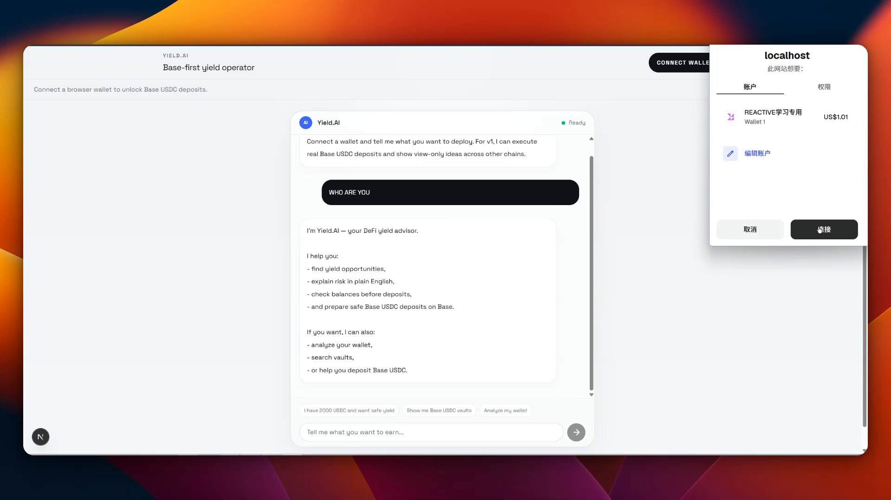

# Yield.AI

> AI Native DeFi yield agent built for the [DeFi Mullet Hackathon #1](https://lifi.notion.site/defi-mullet-hackathon-1-builder-edition) — track: **AI x Earn**.

One chat panel. Connect wallet, ask in plain English, and the agent finds vaults, scores risk, and ships deposits on Base — powered end-to-end by the LI.FI Earn API and Composer.

## Demo

[](public/demo.mp4)

> Click the image to play the full demo (also available at [`public/demo.mp4`](public/demo.mp4)).

## What makes it AI Native

- **No dashboard.** The chat IS the product. Portfolio, vault discovery, risk analysis, and execution all happen inside one conversation.
- **Wallet-aware welcome.** On connect, the agent auto-calls `get_portfolio` and reacts to what it finds — no clicks required.
- **Tool-calling LLM.** GPT-4o-mini orchestrates 6 typed tools across the LI.FI surface, with streaming NDJSON back to the UI.
- **Inline action cards.** Vault cards, position cards, and deposit flows render directly in chat — every recommendation is one click away from a real transaction.

## LI.FI Integration

| Surface | Endpoints used | Tool |
|---|---|---|
| **Earn Data API** (`earn.li.fi`) | `/v1/earn/vaults`, `/v1/earn/vaults/:chain/:addr`, `/v1/earn/portfolio/:addr/positions` | `search_vaults`, `get_vault_details`, `get_portfolio` |
| **Composer** (`li.quest`) | `/v1/quote` (with `toToken = vault address`) | `prepare_deposit` (returns approval info + tx) |

Plus an in-house risk engine (`score_risk`) and a viem-based balance check (`verify_balance`).

## Stack

- Next.js 16 (App Router) + React 19 + TypeScript + Tailwind v4
- `viem` for EIP-1193 injected wallet, ERC20 reads/writes, Base chain
- OpenAI-compatible API (any endpoint with tool calling) for the agent loop
- Direct HTTP to LI.FI APIs, server-side proxy to hide the Composer key

## MVP scope (intentionally narrow)

- ✅ Real deposits on **Base USDC** only
- ✅ Discovery and read-only positions across Ethereum / Base / Arbitrum / Optimism
- ✅ Approval and deposit as separate wallet signatures
- ❌ No withdraw flow
- ❌ No batch / "Deposit All" — single vault deposits only

## Setup

```bash
npm install
cp .env.example .env.local   # then fill in your keys
npm run dev
```

Open [http://localhost:3000](http://localhost:3000) and connect an injected wallet (MetaMask / Rabby / etc.).

### Environment variables

```bash
OPENAI_API_KEY=            # required
OPENAI_MODEL=gpt-4o-mini   # any tool-calling model
OPENAI_BASE_URL=https://api.openai.com/v1  # override for OpenAI-compatible endpoints
LIFI_API_KEY=              # optional — higher rate limits on Composer (75/2h → 100/min)
```

## User flow

1. Connect injected wallet → agent reads your LI.FI portfolio and greets accordingly
2. Ask in natural language: *"I have 100 USDC, find me safe yield"*
3. Agent calls `verify_balance`, then `search_vaults` with risk scoring
4. Click `Prepare deposit` on any Base USDC vault card (or set amount on the fly)
5. Approve USDC spending, then sign the deposit tx
6. Get a BaseScan link — note that LI.FI portfolio indexing has a 5-15 min delay before the new position appears

## Verification

```bash
npm run typecheck
npm run lint
npm run build
```

## Repo

- Live: run `npm run dev` for the local demo
- GitHub: [enderzcx/Yield-ai](https://github.com/enderzcx/Yield-ai)
